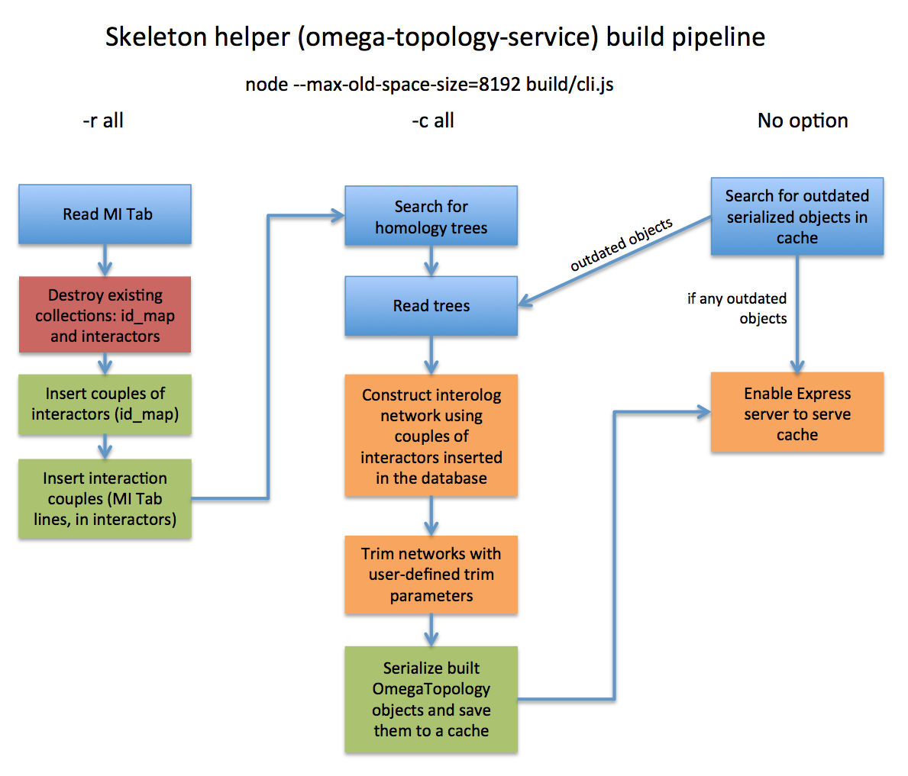

# omega-topology-service

> Serve serialized OmegaTopology objets to graph clients and allows construction of interactors partners from MI Tab file to CouchDB documents 

This service can compute, from homology informations and interaction dataset, a serialized OmegaTopology object in JSON format, stored as called "graph skeleton" in a cache.

Homology informations are specie-specific, and the interaction dataset (MI Tab file) should be specie-agnostic.

This service is *CORS-ready*.

## Installation and out-of-the-box usage

First, clone the repository of omega-topology-service.
```bash
git clone https://github.com/alkihis/omega-topology-service.git
cd omega-topology-service
npm i
```

You need to setup the source directories in order to run the service.

### If you already have a source archive
Just unzip it into root directory.
```bash
unzip source.zip
```

You can now jump to [Usage](#usa) step.

---
### If you already have desired homology data and the MI Tab file

Jump to [Setting up the service](#set) step.

---
### If you have any of that

Jump to [Initial configuration](#ic) step to learn more about how to obtain the base files.


## <a id="ic"></a> Initial configuration

### Source files

To run this service, you need homology informations from the specie of interest.

Look at the [Divisome Factory](https://github.com/glaunay/divisomeFactory) pipeline to obtain the JSON homology tree and a filtered MI Tab file.

Make sure the specie name inside the filename of the homology file is in uppercase, then you can copy it inside the appropriate directory.
```bash
mv uniprot_MY_SPECIE_homology.json source/homology
```


If you already have a MI Tab file and in order to keep the MI Tab file unique, you can merge the MI Tab files together with `utils/mitab_merger.py` (**Python 3.5+ is required**).
This script takes all the files to merge in argument and produce a `merged.mitab` file to copy inside the `source/mitab` folder.

```bash
# Merge obtained MI Tab with existing MI Tab in source directory
./utils/mitab_merger.py my_mitab.mitab source/mitab/merged_uniprot_safe.mitab

# Remove the old unmerged
rm source/mitab/merged_uniprot_safe.mitab

# Move the merged inside source
mv merged.mitab source/mitab/merged_uniprot_safe.mitab
```

### <a id="set"></a> Setting up the service

`omega-topology-service` need some directories in order to read and store homology files and interaction data.

All the directory names can be changed in configuration file.

Setup the directory tree:
```bash
mkdir -p source/homology
mkdir source/mitab
```

Then, copy or move your homology JSON files and MI Tab files into the correct directories:
```bash
mv uniprot_*_homology.json source/homology
mv merged_uniprot_safe.mitab source/mitab
```

Homology files **must** follow the following schema: `uniprot_<specie_name_uppercase>_homology.json`.

If you want to change the MI Tab filename, specify its path in the configuration file (`mitab` key).

### Setting up CouchDB

`omegalomodb` is required in order to run bulked requests in this service. You can configure its address into the configuration file, under the `omegalomodb` key.

Furthermore, a direct link to CouchDB is also required, in order to create and fill collections. Address can be found and configurated in the `couchdb` key of the configuration file. 

### Configuration file

Configuration file is a JSON document inside a file that implements the `Config` interface, as defined into `ts/src/helpers.ts` file.

```ts
interface Config {
    /** Trees directory. Must contains only .json homology trees. */
    trees: string, 
    /** MI Tab file (common for all species) */
    mitab: string, 
    /** CouchDB database URL (with port) */
    couchdb: string, 
    /** Cache directory. MUST be created. Where the cached skeletons will be stored. */
    cache: string, 
    /** Maximum days until auto cache renew. */
    max_days_before_renew: number, 
    /** omegalomodb request agregator URL */
    omegalomodb: string, 
    /** Database names, where the MI Tab file will be stored into CouchDB. */
    databases: { 
        /** Interactors couples. { [id1: string]: ListOfInteractorsIdOfId1<string> } */
        partners: string, 
        /** Interactors couples, with MI Tab lines. { [id1: string]: { [interactorId: string]: ListOfMitabLinesOf[Id1:interactorId]Interaction<string> } }  */
        mitab_lines: string 
    },
    /** On skeleton construct, parameters that will be transmitted 
     * to the `trimEdges` method of the OmegaToplogy object.
     * False mean no parameter. */
    auto_trim: false | {
        idPct: number,
        simPct: number,
        cvPct: number
    }
}
```

## <a id="usa"></a> Usage

### Setup database and cache

If you just add a new homology tree, or changed the MI Tab file, you need to rebuild database and/or tree cache.

#### Build all (recommanded at first start)
This will build the database, the will construct cache for all species found in `trees` directory.

```bash
# --max-old-space-size=8192 : Allow node to use 8192 Mo of RAM
# -r all : rebuild all (database + cache) for all species
# -n : Do not enable server after building
node --max-old-space-size=8192 build/cli.js -r all -n
```

You can rebuild database then cache for one specific specie (database will *always* be specie-agnostic).
```bash
# --max-old-space-size=8192 : Allow node to use 8192 Mo of RAM
# -r r6 : rebuild database then the cache for the homology tree of R6
# -n : Do not enable server after building
node --max-old-space-size=8192 build/cli.js -r r6 -n
```

#### Build cache for a specific specie
If the MI Tab file hasn't changed and you want to force to rebuild skeleton cache, the option `-c` is available.
```bash
# -c all : rebuild the cache for all species
node build/cli.js -c all
```

You can replace the `all` parameter with the name of the specie of your choice.

### Quick start

Once the cache and database is setted up, you can run `omega-topology-service` by a single command.
```bash
node build/cli.js
```

You can disable automatic cache rebuild (by default, after 15 days), choose listened port or set a custom log level (default: info).
```bash
# Set a custom port
node build/cli.js -p 3823 # Emit on port 3823

# Set log level
node build/cli.js -l debug # Emit all messages to console

# Disable automatic cache rebuild
node build/cli.js -d
```

More parameters are available, all of them is described using the `-h` or `--help` parameter.

Here's a quick sum up of the differents available pipelines in `omega-topology-service`.



### Requests

One endpoint is available to requests in this service.

The endpoint serve the pre-computed OmegaTopology skeleton computed every 15 days (by default).

Specie name should be in uppercase. If the requested skeleton is not in cache, return a HTTP `404 Not Found` with empty body.

`@url` GET http://<µ-service-url>/tree/:specie-name

`@response` `{ SerializedOmegaTopology }`
